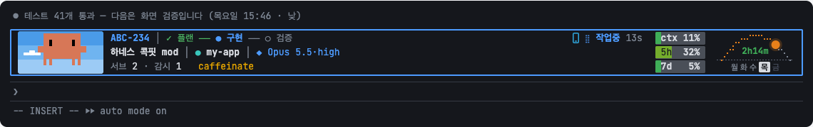
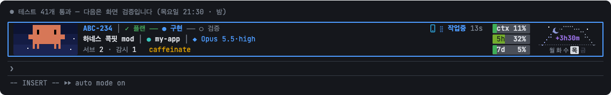
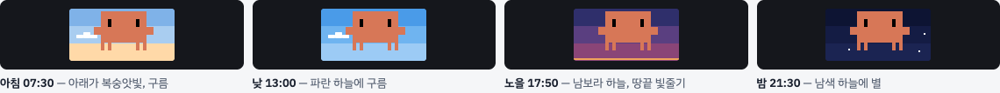
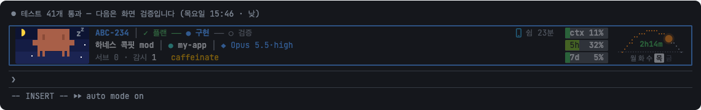
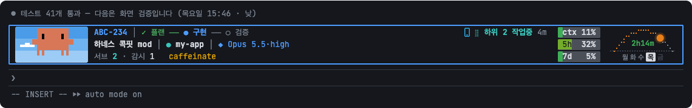
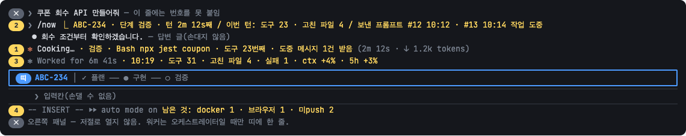
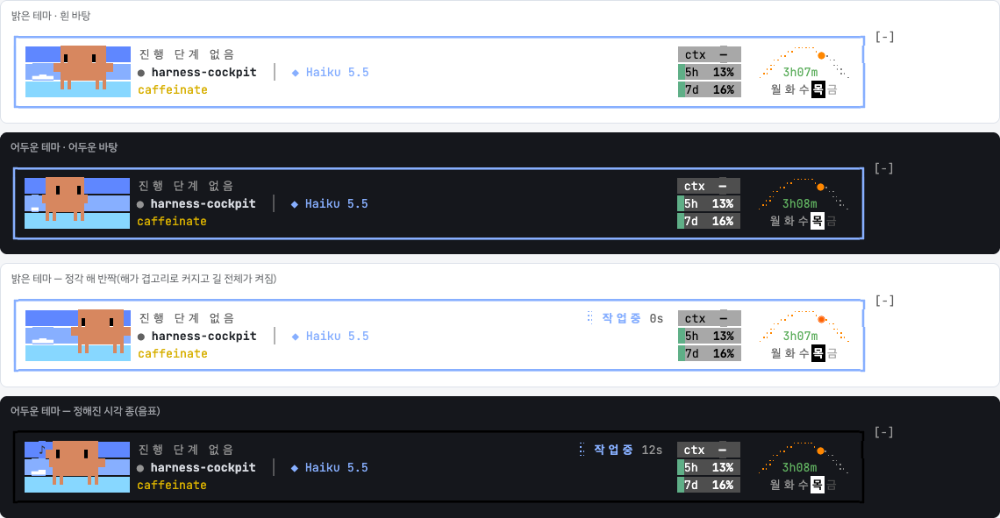
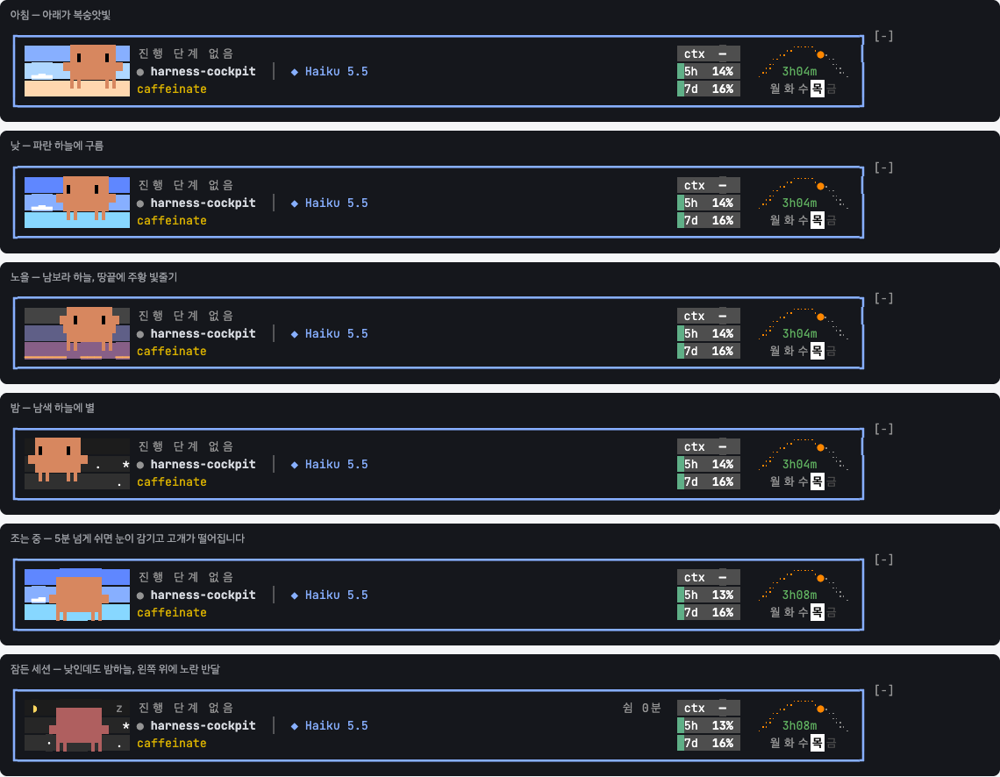

# harness-cockpit

**A Claude Code mod that puts a live status band above your prompt** — progress steps, context and rate-limit usage, running subagents, a sun-arc clock with an end-of-day countdown, and an animated Clawd that reacts to what the session is doing.

It only watches. It never blocks or rewrites a tool call.



한국어 설명은 [README.ko.md](README.ko.md).

> The pictures above the "Real screens" section are design renders. The band's own text is in Korean; everything else works regardless of language.

## Install

At the prompt of a Claude Code terminal session:

```
/plugin install harness-cockpit --marketplace KimGyuBek/harness-cockpit
```

Answer `y` to `Add marketplace?`, then press Enter for the user scope. The band appears in that session right away.

To try it from a checkout instead: `claude --plugin-dir <folder>`.

### Requirements

| | |
|---|---|
| Claude Code | A build with mods. Built and checked on 2.1.291 – 2.1.293 |
| OS | Checked on macOS only. CPU / memory and the keep-awake indicator are read with macOS commands (`iostat`, `memory_pressure`, `pmset`) |
| Terminal | 24-bit color recommended. It works in 256 colors, with rougher sky and Clawd colors |
| Width | Everything fits at 127 columns. Narrower windows fold the arc first, then the usage pills, and keep the values as text |

## Reading the band

| Where | What |
|---|---|
| Left picture | Clawd and the sky behind it |
| Row 1 | issue key │ progress steps ··· remote indicator · state badge (working · N subagents working · done · idle N min · waiting for you) |
| Row 2 | session / issue title │ ● repo │ ◆ model · effort |
| Row 3 | counts of subagents · monitors · workers · things left running, and `caffeinate` |
| Pills | `ctx` (context window) · `5h` · `7d` rate-limit usage |
| Arc | where the sun or moon is, time left until the end of the workday, weekdays |

## Features

### Progress steps

`✓ 플랜 ── ● 구현 ── ○ 검증` (plan ── implement ── verify) — which step the session is on. Implementation work goes plan → code → implement → verify → done; research goes research → organize → report.

- Steps are inferred from the tools Claude uses.
- The mod registers one tool, `phase`. When Claude calls it, that value wins. One line in your `CLAUDE.md` ("call `phase` once when you move to the next step") makes the steps accurate.
- Color means state: finished green, active blue, waiting for a decision yellow, blocked red.

### Usage pills

`ctx 11%` `5h 32%` `7d 5%` — the context window and the 5-hour and 7-day limits. Each pill fills with color as the value grows, in five levels (30 / 50 / 70 / 85 %). Unknown values show `—`.

### Sun arc, end-of-day countdown, weekdays

A dotted arc that the sun crosses by day and the moon by night. With a `location` in the config, sunrise and sunset are computed for the date; without one they are fixed at 06:00 and 18:00.

- The number inside is the **time left until the end of the workday** (`4h18m`, `42m`; 18:00 unless you set `quitTime`). It moves gray → green → lime → yellow → orange → red as the time approaches and blinks for the last ten minutes. After that it shows the overtime (`+23m`) in purple. Hidden on weekends.
- The strip below is the week, today highlighted.



### Clawd

The mascot on the left moves with the session: pacing while thinking, reading, hammering while editing, saluting when you press Enter, cheering when a turn ends, startled on an error.

**Machine load, shown on its body** — it turns redder and gains sweat, steam and a shiver as CPU or memory climbs. No numbers, no text.


| Level | Threshold |
|---|---|
| Caution | CPU 50 % or memory 75 % |
| High | CPU 80 % for 30 s, or memory 85 %, or a memory-pressure warning |
| Critical | CPU 95 % for 60 s, or memory 93 %, or critical memory pressure |

**Sky** — the cells behind Clawd change with the time of day: morning, day, sunset, night, with clouds and stars.



**Dozing and sleeping** — after 5 idle minutes Clawd starts nodding off. After 15 it sleeps, and the sky turns to night with a yellow half moon whatever the hour. After 60 the whole band dims. Typing a prompt wakes it. Idle time is counted per session.



### Working border

The border color tells which group of repos the session is in (blue by default, red for the groups you configure). While the session works, the border blinks between that color and black every 0.6 s. A session whose main turn is idle but whose subagents are still running counts as working.



### Remote and keep-awake indicators

- A phone glyph in front of the badge while Remote Control is on.
- The word `caffeinate` at the end of row 3 while `caffeinate` is keeping the display awake.

### Subagents, monitors, things left running

Row 3 shows the counts; `/cockpit` opens a side panel with the full lists. A subagent that has been silent for ten minutes is marked stalled. Things this session left running — docker containers, browsers, unpushed commits — are counted too.

### Time effects

No text, only motion. They play in every open session at once.

| When | Effect |
|---|---|
| Weekday times you list in `bells` | Clawd rings a bell |
| Every hour on the hour | The sun on the arc flashes and the whole path lights up |

### Outside the band



| Place | Content |
|---|---|
| Spinner line | current step · the command being run · tool count · messages received mid-turn |
| Turn-finished line | a receipt — end time · tools · files changed · failures · context and limit growth |
| Line under the input | what this session left running |
| `/now` | a summary of the session so far, without calling the model (zero tokens) |

### Also

- **Session title** — set once, from the issue title, only when the session has no name. A name you typed is never touched.
- **Start effects** — a 2–3 second intro when a new session opens. Pick or disable with `/fx`.
- **Alert line** — while a file you list as an alert file exists, the border turns double red and an alert line appears on top.

## Commands

| Command | Does |
|---|---|
| `/now` | progress summary (zero tokens) |
| `/cockpit` | open the side panel |
| `/cockpit sky on\|off` | sky behind Clawd (saved) |
| `/cockpit sky morning\|day\|sunset\|night\|auto` | preview a sky |
| `/cockpit poll` | show polling intervals; change one with `/cockpit poll sys 3` (saved) |
| `/cockpit idle` | this session's last activity and idle stage |
| `/cockpit fx bell\|hour` | play a time effect now |
| `/cockpit config` | show what was read from the config file; `/cockpit config reload` re-reads it |
| `/clawd on\|off` | show or hide Clawd |
| `/fx` | start effects — preview `/fx 1 3`, choose `/fx use 1 3`, disable `/fx off` |
| `/leftovers` | list what this session left running |

## Configuration

Optional. Create `~/.claude/harness-cockpit.json` (see [docs/config.example.json](docs/config.example.json)). Without it the band still works; the items below are simply absent.

```json
{
  "repos": [
    { "match": "/work/shop(/|$)", "name": "Shop", "color": "#39C5BB", "family": "red", "brand": "Shop", "word": "SHOP" }
  ],
  "alertFiles": [{ "path": "/tmp/.allow-prod-once", "label": "prod" }],
  "alert": { "title": "Approval flag", "note": "the next production query will pass" },
  "branchKey": "(shop|web)-[0-9]+",
  "branchKeyFlags": "i",
  "serviceWindow": { "label": "dev server", "startHour": 9, "endHour": 21 },
  "location": { "lat": 51.48, "lon": 0.0 },
  "quitTime": "18:00",
  "bells": ["12:00"]
}
```

| Key | Meaning | Without it |
|---|---|---|
| `repos[].match` | a regular expression tested against the session's working folder | — |
| `repos[].name` · `color` | repo label and dot color on row 2 | the folder name, dimmed |
| `repos[].family` | `red` or `blue` — the border color | blue |
| `repos[].brand` · `word` | name and big wordmark used by the start effects | the folder name |
| `alertFiles[]` | files that turn the band into an alert while they exist. Only the session that created the file shows the alert | no alerts |
| `alert.title` · `note` | wording of the alert line | "경보 파일" |
| `branchKey` | pattern that pulls an issue key out of the branch name | upper-case keys like `ABC-123` |
| `serviceWindow` | something that only runs on weekdays between two hours; shown in the briefing start effect | the line is omitted |
| `location` | latitude and longitude for sunrise and sunset (the time zone is the computer's) | sunrise 06:00, sunset 18:00 |
| `quitTime` | end of the workday, `HH:MM` | 18:00 |
| `bells` | weekday times at which Clawd rings a bell | none |
| `verifyCommand` | a regular expression for extra commands that count as the verify step | the built-in list (jest, vitest, npm test, …) |
| `texts` | your own wording for a few lines (`leftClear`, `leftBusy`, `leftPane`, `boardHint`) | the built-in wording |
| `issue.mcpServer` · `keyPattern` | MCP server whose `get_issue` returns the issue title | `linear`, keys like `ABC-123` |
| `issue.boardCommand` · `boardLineDir` · `fleetRoot` | hooks into the author's own task-board and multi-session tools | those chips are absent |

One value is still a code constant:

| What | File | Name | Default |
|---|---|---|---|
| Doze / sleep / dim | `hooks/model.js` | `IDLE_DEFAULT` | 5 / 15 / 60 min |

## Cost

Measured on one Mac; treat the numbers as an order of magnitude.

| | |
|---|---|
| One idle session | 1.8 – 1.9 % of one core (0.45 % with every customization off) — the mod is about 1.4 points at most |
| Of which Clawd | about 0.8 points. After 15 idle minutes it redraws once a second |
| Tokens | 228 per request (the `phase` tool definition). Pictures and effects cost none |
| Machine load and keep-awake sampling | one open session samples; the others read its result file |

Values the engine reports as events (working, step, tool count, subagents, context) are never polled. A sleeping session polls six times less often.

## Real screens

Captured in a 256-color test terminal, so colors are rougher than in a 24-bit terminal.





## Known limits

- Numbering your own prompt lines is not possible — the engine does not draw what a mod returns for those rows. `/now` lists the prompts instead.
- Picture cells (Clawd, the arc) cannot follow the terminal theme, so they use fixed mid-tone colors that read on both light and dark backgrounds.
- Installing through `/plugin install` from GitHub has not been run end to end yet. `claude plugin validate` passes and the mod loads through `--plugin-dir` and `CLAUDE_CODE_PLUGIN_DIRS`.
- This is an unofficial community mod and is not affiliated with Anthropic.

## Layout and development

```
.claude-plugin/plugin.json        manifest
.claude-plugin/marketplace.json   makes this repository installable as a marketplace
hooks/register.js                 event watching, state, polling, commands
hooks/model.js                    pure logic (step inference, color levels, idle, wording)
hooks/view.js                     band and panel trees
hooks/clawd.js                    Clawd scenes and picture cells
hooks/arc.js                      sun arc, countdown, sky, time effects
hooks/poll.js                     polling intervals, machine load parsing
hooks/config.js                   the optional config file
hooks/fx.js · mascot.js           start effects
tests/                            81 unit tests
```

```
claude plugin validate .
claude plugin test
```
